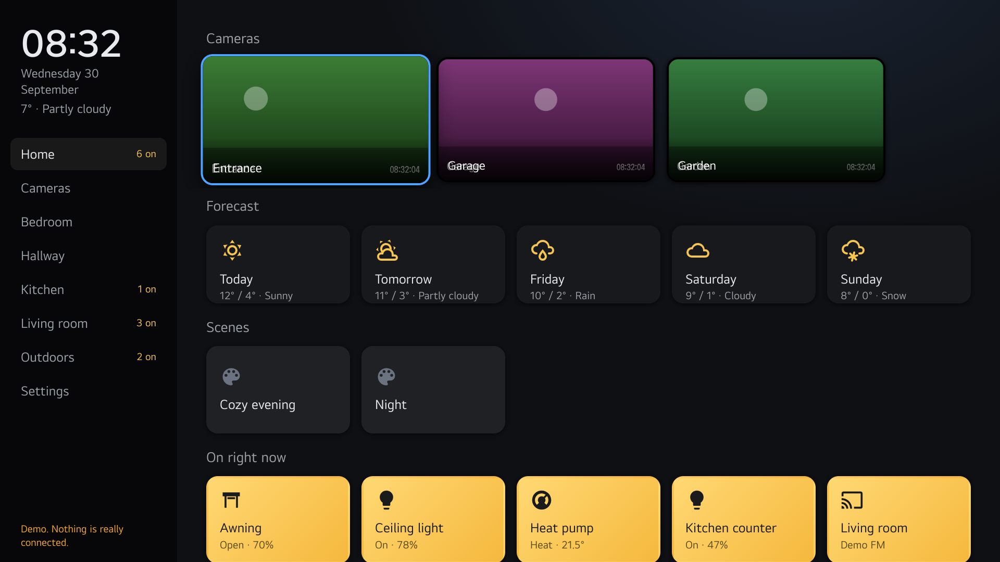
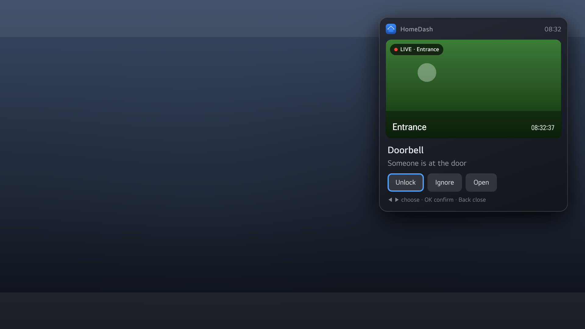
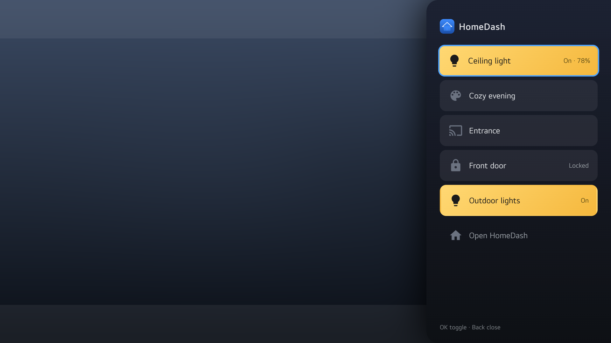
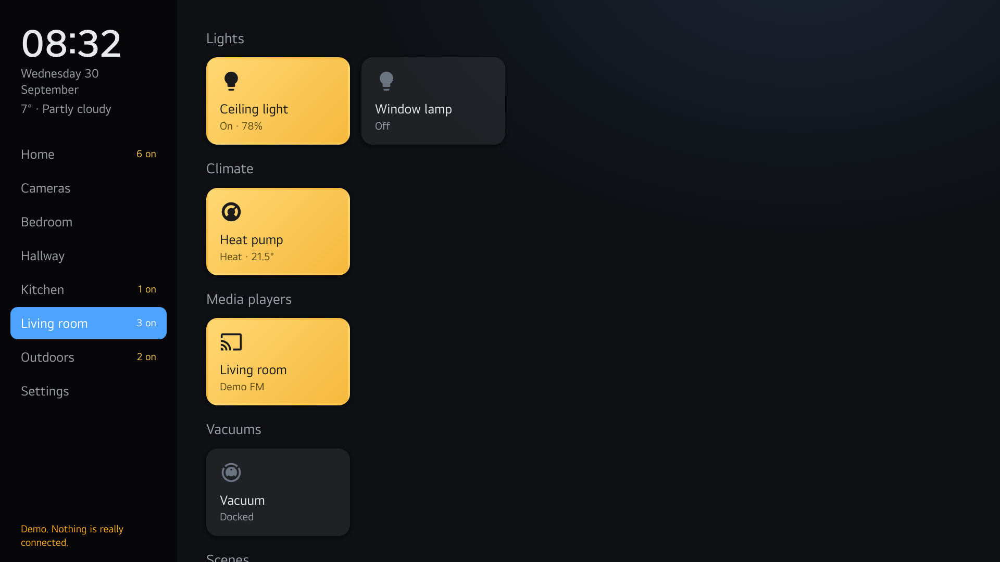
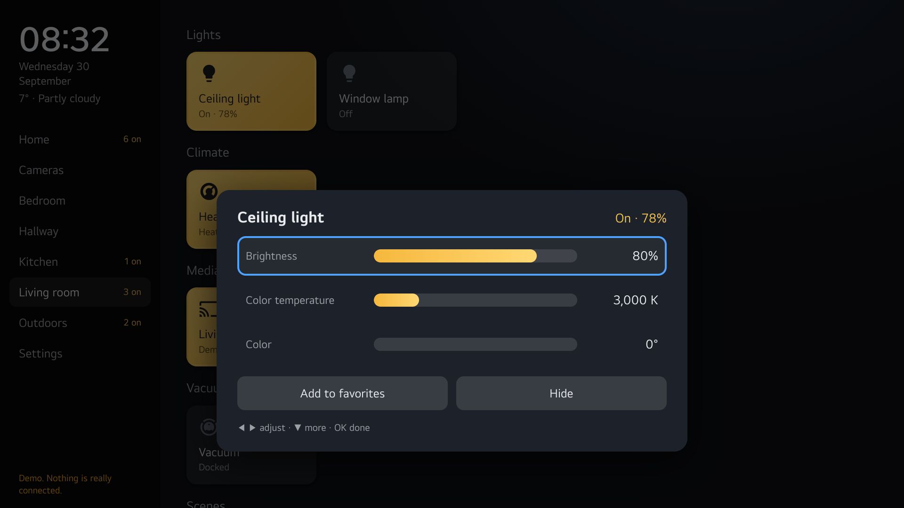
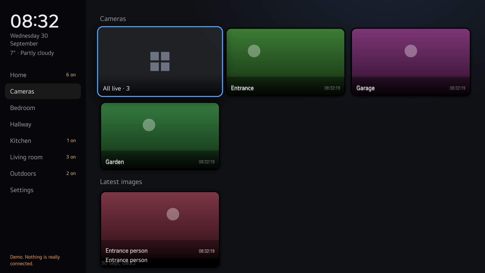
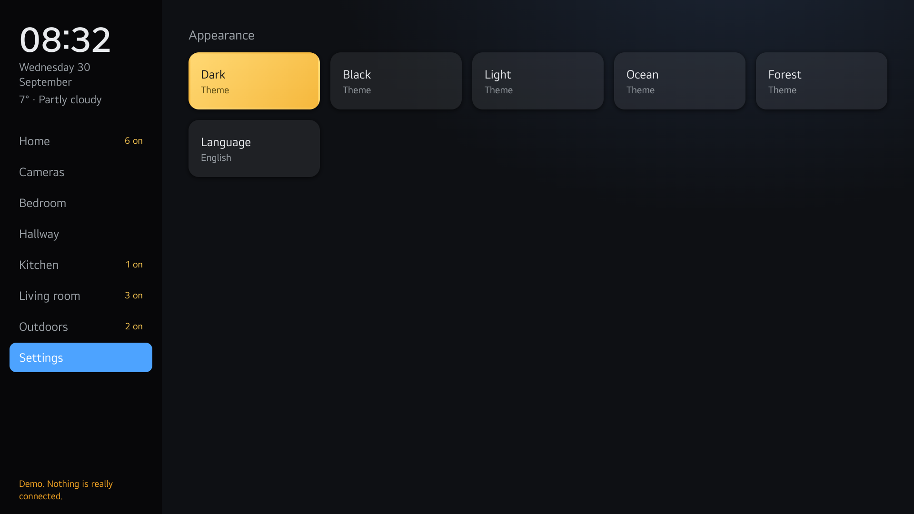
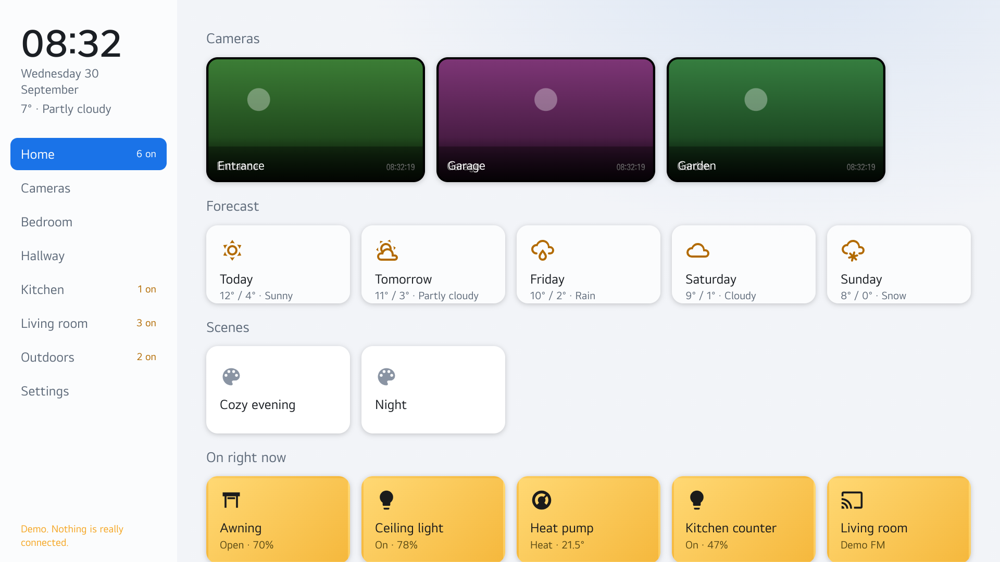
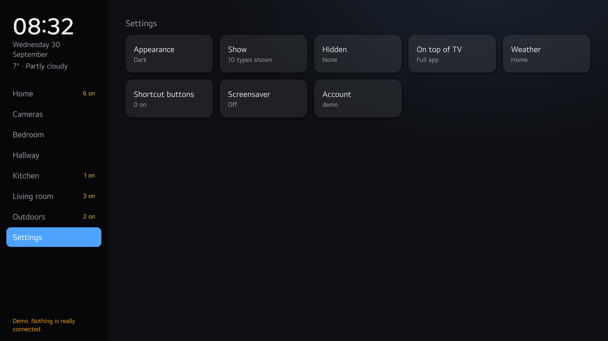

# HomeDash for webOS

A Home Assistant app for LG webOS TVs. Rooms, cameras and every entity type, plus notifications, a pinned camera and a quick menu that are drawn **on top of whatever the TV is showing**.

Nothing is tied to a particular installation: rooms, entity types, names and state texts all come from the Home Assistant you sign in to.



## Features

- **Rooms and every entity type**, with Home Assistant's own translations of states and types
- **Cameras**: live view, camera wall, picture-in-picture, pin on top of the TV picture, PTZ control (Frigate and ONVIF), latest images from image entities
- **Long press on a tile**: brightness, color and color temperature, temperature and modes, volume and source, alarm with PIN, 24-hour history for sensors, favorite and hide
- **Home**: forecast, scenes, favorites and everything that is on right now
- **Notifications** on top of the TV picture, with text, live camera image and buttons that control Home Assistant
- **Quick menu** with favorites along the edge of the screen
- **Settings**: themes, which types to show, hidden entities, weather source, shortcut buttons on the remote, screensaver with cameras, language
- **Sets up Home Assistant from the TV**: adds the TV to the webOS TV integration, creates the scripts and installs automation blueprints, all from Settings
- **Demo mode** without Home Assistant, sign-in via QR code from a phone
- **Twelve languages** for the app's own texts; Home Assistant's texts follow the TV language

| | |
|---|---|
|  |  |
|  |  |
|  |  |
|  |  |

The overlay screenshots show the app on top of a neutral backdrop; on the TV the current channel or app shows through.

## Install

The app is not in the LG Content Store yet. Until then it is installed with LG's developer tools:

1. Install the **Developer Mode** app on the TV and sign in with a free LG developer account. Turn on Dev Mode and Key Server.
2. Install the webOS CLI on your computer: `npm install -g @webos-tools/cli`
3. Register the TV and install the package:

```sh
ares-setup-device --add tv -i "host=<TV IP>" -i "port=9922" -i "username=prisoner"
ares-novacom --device tv --getkey        # enter the passphrase shown in Developer Mode
ares-install --device tv homedash_<version>.ipk
ares-launch --device tv com.frodan.homedash
```

On first start the app searches the network for Home Assistant. Sign in on the TV, or scan the QR code and sign in from your phone. There is also a demo mode that needs no server.

## Build

```sh
./build.sh
```

Builds two variants of the same code into `dist/`:

- `homedash_<version>.ipk` uses the `overlay` window type and can draw on top of other content. Works in Developer Mode on webOS 26.
- `homedash-store_<version>.ipk` runs in a regular window, for the LG Content Store in case overlay windows are not accepted there. Notifications are then shown inside the app, and the pinned camera and quick menu are not available.

## Home Assistant

Notifications, the quick menu and the screensaver are started from Home Assistant through the [LG webOS TV integration](https://www.home-assistant.io/integrations/webostv/).

The easiest way to set that up is from the TV: **Settings → Home Assistant** adds the TV to the integration (the TV asks you to accept the connection), creates the scripts `homedash_notify`, `homedash_menu` and `homedash_screensaver`, and installs two automation blueprints ("show a camera on the TV" and "screensaver when nobody is watching"). This needs an administrator account in Home Assistant. `ha-examples.yaml` shows the same things as YAML.

Launch parameters:

```
{"camera": "camera.garage"}                            open a camera full screen
{"title": "…", "message": "…", "camera": "…",          notification on top of the TV picture
 "image": "…", "timeout": 15, "position": "top-right",
 "actions": [{"label": "…", "service": "lock.unlock", "entity_id": "…"},
             {"label": "…", "event": "…"}]}
{"menu": true}                                         quick menu with favorites
{"saver": true}                                        screensaver on top of the TV picture, any button exits
{"url": "192.168.1.10", "token": "…"}                  sign in with a long-lived token
```

A notification button with `event` fires the event `homedash_action` in Home Assistant with `action` set to the event name, so an automation can react to it.

Settings are stored on the TV and in Home Assistant (per user, key `homedash`), so they survive a reinstall and follow you to other TVs.

## Project layout

- `app/` the app. `logic.js` is pure logic, `app.js` the UI, `lang.js` the texts, `demo.js` the built-in demo Home Assistant.
- `app/variant.js` tells the app whether its window is an overlay. Overwritten by `build.sh` for the store variant.
- `service/` a small service on the TV that serves the sign-in page to the phone while the QR code is shown.
- `test/` unit tests and an end-to-end test that runs the app in headless Chromium against a fake Home Assistant: `cd test && npm install && npm test`

## Languages

Swedish and English were written by hand. German, French, Spanish, Italian, Dutch, Danish, Norwegian, Finnish, Polish and Portuguese have not been reviewed by native speakers yet. Everything lives in `app/lang.js`, one block per language; corrections and new languages are welcome.

## Credits

- Icons from [Material Design Icons](https://pictogrammers.com/library/mdi/), Apache License 2.0
- QR codes by [qrcode-generator](https://github.com/kazuhikoarase/qrcode-generator), MIT

Home Assistant is a trademark of the Open Home Foundation. This project is not affiliated with it.

## License

MIT, see `LICENSE`.
